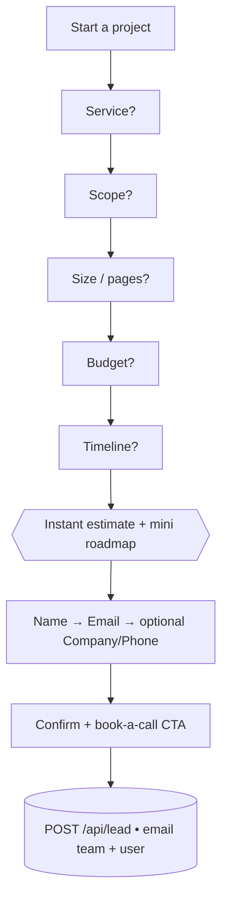
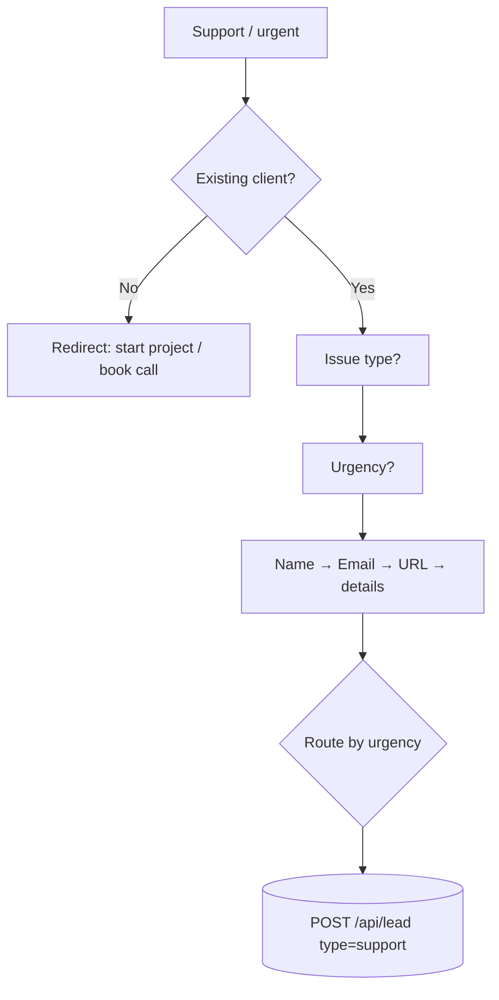
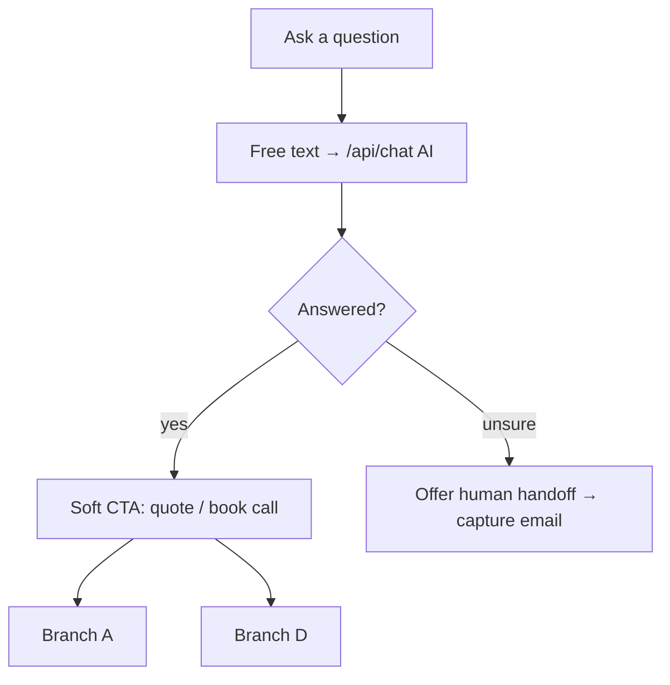

# Digital Karvan — Chatbot Flow Proposal (v1, for discussion)

> Status: **DRAFT for discussion.** Nothing here is implemented yet. Once we agree
> the branches, questions, quote logic and where leads go, I'll build it.

---

## 1. Goal & what "good" looks like

The bot is a **guided lead-qualification + instant-quote assistant** (the
monkeysat.work model), *not* a free-text-only AI chat. Its job:

1. **Capture intent fast** (project / support / question / booking).
2. **Qualify the lead** with a few low-friction questions (service, scope,
   budget, timeline).
3. **Give instant value** — an indicative price range and next steps — *before*
   asking for contact details.
4. **Capture the lead** and hand off to a human ("a team member will follow up").
5. Offer a **free-text AI fallback** (your existing Render chatbot) for anything
   off-script.

### KPIs we'd optimise for
- Conversation start rate (opens → first click)
- Completion rate (start → lead captured)
- Qualified-lead rate (has budget + timeline + email)
- Booked calls
- Cost per lead / response time

---

## 2. Design principles (marketing best practice)

These shape every step below:

- **One question per step.** Never a wall of fields. Momentum > forms.
- **Buttons before typing.** Quick-reply chips reduce friction and keep data clean.
- **Value before the ask.** Give the estimate/roadmap first, request email second.
- **Progressive commitment.** Small yes's build to the big yes (micro-commitments).
- **Always an escape hatch.** "Book a call" and "Talk to a human" available at any step.
- **Social proof, sprinkled.** "We've delivered 50+ projects, 100% client
  satisfaction" at the right moments to reduce risk.
- **Set expectations.** Reply times (within 24h / 1 business day), hours
  (Mon–Fri 9:00–18:00 GMT), and that a human finalises details.
- **Respect the user.** Consent line before capturing data; easy exit; no dark patterns.
- **Personality.** On-brand, warm, concise ("Smart Tech. Simple Solutions.").

---

## 3. Persona & tone

- **Name:** "Karvan Assistant" (or "DK Assistant").
- **Voice:** friendly expert — confident, plain-English, a little warmth, zero jargon.
- **Length:** short messages, 1–2 lines, emoji used sparingly.
- **Example greeting:**
  > 👋 Hi, I'm the Karvan Assistant. I can scope your project and get you an
  > instant ballpark in ~60 seconds — or connect you with the team. What brings you in?

---

## 4. Architecture (how it maps to our stack)

A **hybrid**: mostly scripted state-machine (fast, predictable, great data) with
an **AI fallback** to your Render backend for free text.

```
Chat widget (React, this theme)
   │  scripted flow = client-side state machine (steps + quick replies)
   │
   ├── free-text question ──► POST /api/chat ──► Render AI backend ({message}→{reply})
   │
   └── lead captured ───────► POST /api/lead  ──► email via SMTP (like /api/contact)
                                              └─► (optional) CRM / Google Sheet / webhook
```

- **Scripted steps**: no server needed — instant, reliable, on-brand.
- **AI fallback**: reuse the `/api/chat` proxy you already have.
- **Lead submission**: a new `/api/lead` route (mirrors `/api/contact` SMTP
  pattern) that emails the team a structured summary + sends the user a
  confirmation. Optionally also push to a CRM/Sheet/webhook later.

---

## 5. Entry point (the opening screen)

**Launcher:** bubble bottom-right, subtle attention pulse until first open.

**Opening message + quick replies (the "intent router"):**

> **Let's get started — how can we help?**

| Quick reply | Goes to |
|---|---|
| 🚀 **Start a project** (get an instant quote) | Branch A |
| 🛠️ **Support / urgent issue** | Branch B |
| 💬 **Just have a question** | Branch C (AI) |
| 📅 **Book a call** | Branch D |

Persistent footer actions (always visible): **"See our work"** (→ /portfolio),
**"Talk to a human"** (→ Branch D / contact).

---

## 6. Branch A — Start a Project (the money branch) 💸

Goal: qualify + instant quote + capture. ~5 quick steps, then value, then ask.

**A1. Which service?** (buttons — mirrors our 4 services)
- Website Design & Development
- Branding & Identity Design
- Website Maintenance & Support
- Consultation & Technical Guidance
- *Something else / not sure* → free-text → AI assist, then continue

**A2. Scope** (branch by service — example for Website):
- *New website from scratch*
- *Redesign of an existing site*
- *Web app / portal / dashboard*
- *E-commerce / online store*

**A3. Size / pages** (buttons): 1–5 pages · 6–15 pages · 15+ / complex · Not sure

**A4. Budget** (buttons — matches your quote form ranges):
- Under £5,000 · £5,000–£15,000 · £15,000–£30,000 · £30,000+ · Not sure yet

**A5. Timeline** (buttons): ASAP (<4 wks) · 1–2 months · 3+ months · Just exploring

**➡️ Instant value (before the ask):**
> Based on that, a **[Website Design & Development]** project like yours typically
> runs **£X–£Y** and takes **4–12 weeks**. Here's a rough plan: Discovery →
> Design → Build → Launch. Want the team to put together a tailored proposal?

*(Estimate comes from the table in §9. Social proof line here: "We've shipped
50+ of these.")*

**A6. Capture** (one at a time, with a consent line):
- Name → Email → *(optional)* Company / website → *(optional)* Phone

**A7. Confirm + next step:**
> 🎉 Thanks [Name]! Your estimate and details are with the team — we reply within
> **1 business day**. Prefer to talk now? **[Book a call]**.

→ **POST /api/lead** (type: `project`), plus optional calendar link.



---

## 7. Branch B — Support / Urgent Issue 🛠️

Goal: triage fast, set expectations, route by urgency.

**B1. Are you an existing client?** Yes · No
- *No* → gently redirect: "We mainly support projects we've built — want to start
  one, or book a consultation?" → Branch A / D.

**B2. What's happening?** (buttons)
- Site is down / broken
- Bug or something not working
- Content / update request
- Security concern
- Billing / account

**B3. Urgency** (buttons): 🔴 Critical (site down) · 🟠 High · 🟢 Normal

**B4. Capture:** Name → Email → *(optional)* URL affected → short description.

**B5. Route + expectation:**
- 🔴 Critical → show direct contact + "flagged as urgent, we'll jump on it." (After
  hours: show hours + emergency instructions.)
- Others → "Logged — we'll respond within [SLA]."

→ **POST /api/lead** (type: `support`, includes urgency).



---

## 8. Branch C — Just have a question (AI free-text) 💬

Goal: answer instantly, then convert.

- Opens a **free-text** chat backed by your Render AI (`/api/chat`).
- Seeded context so it answers about services, process, pricing ranges, timelines.
- After 1–2 answers, a **soft CTA** appears: "Want an instant quote?" (→ Branch A)
  or "Book a call?" (→ Branch D).
- **Guardrail:** if the AI is unsure or asked for commercial specifics, it offers
  to hand off: "Best to get the team on this — shall I grab your email?"



---

## 9. Branch D — Book a Call 📅

Goal: the fastest path for hot leads.

- **D1.** "Great — the quickest way is a 20-min discovery call."
- **D2.** Two options:
  - **Pick a time** → embed scheduling (Calendly/Cal.com) *(needs a link from you)*.
  - **Request a callback** → capture Name → Email → Phone → preferred time window
    (Mon–Fri 9–18 GMT) → **POST /api/lead** (type: `call`).
- **D3.** Confirmation + what to expect on the call.

---

## 10. Instant-quote logic (indicative ranges — please sanity-check)

Ranges are **configurable** and shown as "typical / indicative," never a fixed
price. Baselines derived from your site (small sites from £3k; comprehensive
£15k+). **These are placeholders for you to correct.**

| Service | Scope | Indicative range | Typical timeline |
|---|---|---|---|
| Website Design & Dev | Starter (1–5 pages) | £3,000 – £6,000 | 3–5 wks |
| Website Design & Dev | Business/marketing (6–15 pages) | £6,000 – £15,000 | 5–8 wks |
| Website Design & Dev | Web app / portal / e-commerce | £15,000 – £40,000+ | 8–16 wks |
| Branding & Identity | Logo + core identity | £1,500 – £6,000 | 2–4 wks |
| Branding & Identity | Full brand system + guidelines | £6,000 – £15,000 | 4–8 wks |
| Maintenance & Support | Care plan (retainer) | £150 – £800 / month | ongoing |
| Consultation & Guidance | Audit / strategy / roadmap | from £500 (or day rate) | 1–2 wks |
| AI / Data (from portfolio) | Custom scope | "Let's scope on a call" | varies |

**Rule:** if the user's **budget** is below the scope's typical range, the bot
reframes ("At that budget we'd suggest starting with X") instead of rejecting —
keeps the lead warm.

---

## 11. Lead data model (what we send to `/api/lead`)

```json
{
  "type": "project | support | call",
  "name": "…",
  "email": "…",
  "phone": "…?",
  "company": "…?",
  "service": "Website Design & Development",
  "scope": "New website",
  "size": "6–15 pages",
  "budget": "£5,000–£15,000",
  "timeline": "1–2 months",
  "estimateShown": "£6,000–£15,000",
  "urgency": "critical?",
  "message": "free-text notes",
  "transcript": ["…full conversation for context…"],
  "source": "chatbot",
  "page": "/services/website-design-development"
}
```

→ emails the team a formatted summary (+ confirmation to the user), same SMTP
pattern as `/api/contact`. Optionally also POST to a CRM/Google Sheet/webhook.

---

## 12. Edge cases & guardrails

- **After hours** (outside Mon–Fri 9–18 GMT): adjust copy — "The team's offline
  now; we'll reply first thing (GMT). For urgent site-down issues: [contact]."
- **Invalid email:** inline validation, friendly re-ask.
- **Drop-off:** state is saved so returning users resume; optional "still there?"
  nudge.
- **Repeat/returning visitor:** greet differently, skip intro.
- **Consent/GDPR:** one-line consent before capturing contact details.
- **AI cold-start:** your Render free tier can take ~30–50s — show a "warming up…"
  note so it doesn't feel broken.
- **Human handoff:** any step → "Talk to a human" → Branch D / email capture.

---

## 13. Analytics events to track (for optimisation)

`chat_opened`, `intent_selected`, `service_selected`, `budget_selected`,
`estimate_shown`, `email_captured`, `lead_submitted`, `call_booked`,
`ai_fallback_used`, `dropped_at_step`.

---

## 14. Sample copy deck (tone reference)

- **Greeting:** "👋 Hi, I'm the Karvan Assistant — I can ballpark your project in
  about a minute, or connect you with the team. What brings you in today?"
- **Budget ask:** "Roughly what budget are you working with? (This just helps us
  tailor the right approach — no wrong answers.)"
- **Value moment:** "Nice — a project like this usually lands around **£X–£Y** and
  takes **N weeks**. We've delivered 50+ of these. Want a tailored proposal?"
- **Capture:** "Where should the team send your estimate? (We reply within 1
  business day — no spam, ever.)"
- **Confirm:** "🎉 All set, [Name]! Your details are with the team. Prefer to talk
  now? Grab a slot 👉 [Book a call]."

---

## 15. Decisions I need from you (let's discuss)

1. **Branches:** keep all four (Project / Support / Question / Book a call)? Add
   or drop any? (e.g., a "Pricing guide" or "See our work" branch.)
2. **Quote ranges (§10):** are these numbers right? Give me your real ranges.
3. **AI fallback:** use your Render chatbot for Branch C free-text? Yes/no.
4. **Booking:** do you have a Calendly/Cal.com link to embed, or callback-request only?
5. **Where do leads go:** email only (SMTP), or also CRM / Google Sheet / webhook?
6. **Support SLAs:** what response times should we promise per urgency?
7. **Personality/name:** "Karvan Assistant" ok? Any tone tweaks?
8. **Data/consent:** any specific GDPR/privacy wording you want shown?

---

## 16. Suggested build phases (once approved)

- **Phase 1:** Scripted flow widget (Branches A, B, D) + `/api/lead` (email). No AI.
- **Phase 2:** Branch C AI free-text via `/api/chat` + soft CTAs.
- **Phase 3:** Analytics events + optional CRM/Sheet/webhook + calendar embed.
- **Phase 4:** A/B test copy, estimate ranges, and step order to lift completion.
